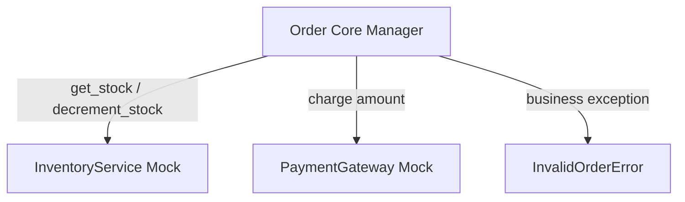

# Mock Testing — Order Processing System

This report covers the design, business logic, and testing strategy for the order checkout pipeline.

---

## 🏗️ Architecture & Component Design

The module consists of two external services (to be mocked) and a core `Order` manager that orchestrates the cart business rules:

### 1. External Services (Interfaces)
- **`InventoryService`**:
  - `get_stock(product_id: str) -> int`: Queries available units in stock.
  - `decrement_stock(product_id: str, quantity: int)`: Deducts stock upon successful checkout.
- **`PaymentGateway`**:
  - `charge(amount: float, currency: str) -> bool`: Reaches third-party billing servers (Stripe/PayPal) and returns charging success.

### 2. Core `Order` Object
Maintains the items dictionary (each item having a price and quantity), order status (DRAFT/PAID), customer email, and VIP privilege flag.

---

## ⚙️ Business Rules

1. **Cart Validation**:
   - Rejects items with negative prices or quantities $\le 0$.
   - Prevents checks out on empty carts.
2. **Discount Tiers**:
   - **VIP discount**: Flat 20% off the total cart price (retains precedence).
   - **Regular discount**: 10% off if the total price exceeds $100.
   - **Default**: No discount.
3. **Transactional Checkout Workflow**:
   - Verify cart has items.
   - Check stock for all items; raise `InventoryShortageError` if stock is insufficient.
   - Deduct total after discounts.
   - Charge customer using the `PaymentGateway`. If payment fails, raise `PaymentFailedError` and do **not** modify stock.
   - If payment succeeds, commit stock decrements, flag order status as `PAID`, and flag `is_paid = True`.

---

## 🧪 Test Suite Specification (`test_order.py`)

A total of **21 unit tests** check all edge cases, using Pytest fixtures and mock verifications.

### Fixtures Used
- `mock_inventory`: A mock of `InventoryService` with strict spec enforcement.
- `mock_payment`: A mock of `PaymentGateway` with strict spec enforcement.
- `regular_order` / `vip_order`: Instantiated order templates configured with injected mocks.

### Key Assertions Tested
- Cart operations: Adding/removing items, price aggregation, and bounds limits.
- Discount logic parametrization (regular/VIP boundaries).
- Transactional rollbacks (e.g., verifying stock is *not* decremented if payment fails).
- Invocation calls (`assert_called_once_with`) ensuring external APIs are hit with accurate calculated values.
